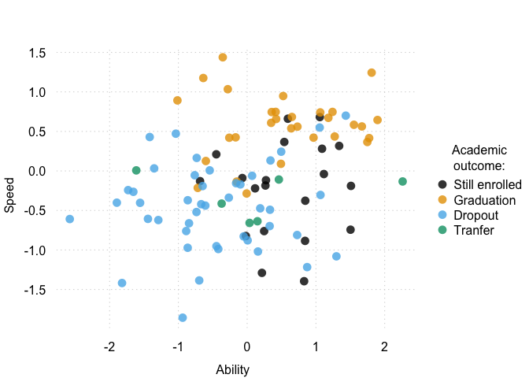
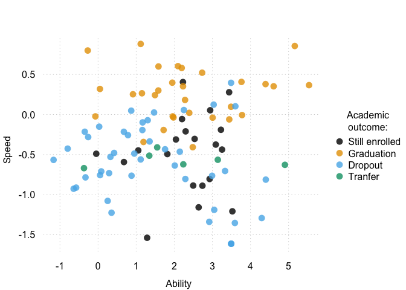

<!-- README.md is generated from README.Rmd. Please edit that file -->

# AcaOut

<!-- badges: start -->

[](https://lifecycle.r-lib.org/articles/stages.html#experimental)

<!-- badges: end -->

## Installation

You can install the development version of AcaOut with:

``` r
devtools::install_github("giuseppealfonzetti/AcaOut")
```

The package is shipped with a function for simulating students data:

``` r
library(AcaOut)
sim_data <- simulate_crirt_data(
    N_STUDENTS = 100,
    N_EXAMS = 10,
    N_GRADES = 3,
    MAX_YEAR = 3,
    N_COV = 1,
    SEED = 123
  )
```

``` r
head(sim_data$gradesMat)
#>           exam_1 exam_2 exam_3 exam_4 exam_5 exam_6 exam_7 exam_8 exam_9
#> student_1      1      1      1      1      1      1      1      1      1
#> student_2      2      1      2      2      1      1      2      2      2
#> student_3      2      3      3      3     NA      2     NA     NA      2
#> student_4      2      1     NA     NA      1      2     NA     NA     NA
#> student_5     NA     NA      2      1      2     NA     NA      1     NA
#> student_6      2      2      2      2      2      1      2      2      2
#>           exam_10
#> student_1       1
#> student_2       2
#> student_3      NA
#> student_4      NA
#> student_5      NA
#> student_6       2
head(sim_data$timeMat)
#>           exam_1 exam_2 exam_3 exam_4 exam_5 exam_6 exam_7 exam_8 exam_9
#> student_1    151     39    635    109    250    343     83    195    773
#> student_2    474     34    424     38    834    143     51     31    304
#> student_3    463     70    722    793     NA    407     NA     NA    734
#> student_4    360     54     NA     NA    215     66     NA     NA     NA
#> student_5     NA     NA    390    379    393     NA     NA    616     NA
#> student_6     81    135    146     68    182    474     65     39    151
#>           exam_10
#> student_1     415
#> student_2      62
#> student_3      NA
#> student_4      NA
#> student_5      NA
#> student_6     211
head(sim_data$outcome)
#> student_1 student_2 student_3 student_4 student_5 student_6 
#>         1         1         0         2         2         1
```

For a quick glance, we can plot students into the latent space, while
highlighting the academic outcome distribution:

``` r
sim_lat <- as.data.frame(sim_data$latent)
sim_lat$outcome <- factor(sim_data$outcome, levels = 0:3, labels = c("Still enrolled", "Graduation", "Dropout", "Tranfer"))
tinyplot::tinytheme("clean2")
tinyplot::tinyplot(
  speed ~ ability | outcome, data = sim_lat,
  cex=1.5,
  alpha=.8,
  palette= "okabe",
  legend=list(title = "Academic\noutcome:"),
  xlab="Ability", ylab="Speed") 
```



The package provides two fitting functions, `fit_EM()` and `fit_BFGS()`,
which, given the quadrature grid and weights, allow to fit the joint
model for outcomes and exams:

``` r

# Setup quadrature
nq <- 12
gq <- statmod::gauss.quad.prob(nq, dist = "normal")
nodes <- gq$nodes
weights <- gq$weights
nodes <- as.matrix(expand.grid(nodes, nodes))
weights <- expand.grid(weights, weights)
weights <- apply(weights, 1, prod)

# Start fit with EM
em_fit <- fit_EM(
    DATA = sim_data,
    GRID = nodes,
    WEIGHTS = weights,
    M_MAX_ITER = 100,
    MAX_ITER = 10,
    TOL = 1e-4,
    MOD = "full"
  )
#> Iter 0:
#> - E-STEP... Weights computed.
#> - M-STEP... Grad evals:1| nll:4759.98- M-STEP... Grad evals:2| nll:4760.01- M-STEP... Grad evals:3| nll:4759.53- M-STEP... Grad evals:4| nll:4764.92- M-STEP... Grad evals:5| nll:4759.65- M-STEP... Grad evals:6| nll:4759.55- M-STEP... Grad evals:7| nll:4759.53- M-STEP... Grad evals:8| nll:4759.53- M-STEP... Grad evals:9| nll:4759.53- M-STEP... Grad evals:10| nll:4759.53- M-STEP... Grad evals:11| nll:4759.53- M-STEP... Grad evals:12| nll:4759.53- M-STEP... Grad evals:13| nll:4759.53- M-STEP... Grad evals:14| nll:4759.53- M-STEP... Grad evals:15| nll:4759.53- M-STEP... Grad evals:16| nll:4759.53- M-STEP... Grad evals:17| nll:4759.53- M-STEP... Grad evals:18| nll:4759.53- M-STEP... Grad evals:19| nll:4759.53- M-STEP... Grad evals:20| nll:4759.53- M-STEP... Grad evals:21| nll:4759.53- M-STEP... Grad evals:22| nll:4759.53- M-STEP... Grad evals:23| nll:4759.53- M-STEP... Grad evals:24| nll:4759.53- M-STEP... Grad evals:25| nll:4759.53- M-STEP... Grad evals:26| nll:4759.53- M-STEP... Grad evals:27| nll:4759.53- M-STEP... Grad evals:28| nll:4759.53- M-STEP... Grad evals:29| nll:4759.53- M-STEP... Grad evals:30| nll:4759.53- M-STEP... Grad evals:31| nll:4759.53- M-STEP... Grad evals:32| nll:4759.53- M-STEP... Grad evals:33| nll:4759.53- M-STEP... Grad evals:34| nll:4759.53- M-STEP... Grad evals:35| nll:4759.53- M-STEP... Grad evals:36| nll:4759.53- M-STEP... Grad evals:37| nll:4759.53- M-STEP... Grad evals:38| nll:4759.53- M-STEP... Grad evals:39| nll:4759.53- M-STEP... Grad evals:40| nll:4759.53- M-STEP... Grad evals:41| nll:4759.53- M-STEP... Grad evals:42| nll:4759.53- M-STEP... Grad evals:43| nll:4759.53- M-STEP... Grad evals:44| nll:4759.53- M-STEP... Grad evals:45| nll:4759.53- M-STEP... Grad evals:46| nll:4759.53- M-STEP... Grad evals:47| nll:4759.53- M-STEP... Grad evals:48| nll:4759.53- M-STEP... Grad evals:49| nll:4759.53- M-STEP... Grad evals:50| nll:4759.53- M-STEP... Grad evals:51| nll:4759.53- M-STEP... Grad evals:52| nll:4759.53- M-STEP... Grad evals:53| nll:4759.53- M-STEP... Grad evals:54| nll:4759.53- M-STEP... Grad evals:55| nll:4759.53- M-STEP... Grad evals:56| nll:4759.53- M-STEP... Grad evals:57| nll:4759.53- M-STEP... Grad evals:58| nll:4759.53- M-STEP... Grad evals:59| nll:4759.53- M-STEP... Grad evals:60| nll:4759.53- M-STEP... Grad evals:61| nll:4759.53- M-STEP... Grad evals:62| nll:4759.53- M-STEP... Grad evals:63| nll:4759.53- M-STEP... Grad evals:64| nll:4759.53- M-STEP... Grad evals:65| nll:4759.53- M-STEP... Grad evals:66| nll:4759.53- M-STEP... Grad evals:67| nll:4759.53- M-STEP... Grad evals:68| nll:4759.53- M-STEP... Grad evals:69| nll:4759.53- M-STEP... Grad evals:70| nll:4759.53- M-STEP... Grad evals:71| nll:4759.53- M-STEP... Grad evals:72| nll:4759.53- M-STEP... Grad evals:73| nll:4759.53- M-STEP... Grad evals:74| nll:4759.53- M-STEP... Grad evals:75| nll:4759.53- M-STEP... Grad evals:76| nll:4759.53- M-STEP... Grad evals:77| nll:4759.53- M-STEP... Grad evals:78| nll:4759.53- M-STEP... Grad evals:79| nll:4759.53- M-STEP... Grad evals:80| nll:4759.53- M-STEP... Grad evals:81| nll:4759.53- M-STEP... Grad evals:82| nll:4759.53- M-STEP... Grad evals:83| nll:4759.53- M-STEP... Grad evals:84| nll:4759.53- M-STEP... Grad evals:85| nll:4759.53- M-STEP... Grad evals:86| nll:4759.53- M-STEP... Grad evals:87| nll:4759.53- M-STEP... Grad evals:88| nll:4759.53- M-STEP... Grad evals:89| nll:4759.53- M-STEP... Grad evals:90| nll:4759.53- M-STEP... Grad evals:91| nll:4759.53- M-STEP... Grad evals:92| nll:4759.53- M-STEP... Grad evals:93| nll:4759.53- M-STEP... Grad evals:94| nll:4759.53- M-STEP... Grad evals:95| nll:4759.53- M-STEP... Grad evals:96| nll:4759.53- M-STEP... Grad evals:97| nll:4759.53- M-STEP... Grad evals:98| nll:4759.53- M-STEP... Grad evals:99| nll:4759.53- M-STEP... Grad evals:100| nll:4759.53- M-STEP... Grad evals:101| nll:4759.53- M-STEP... Grad evals:102| nll:4759.53- M-STEP... Grad evals:103| nll:4759.53- M-STEP... Grad evals:104| nll:4759.53
#> 
#> - obj=4759.53, obj_pdiff:nan|
#> Iter 1:
#> - E-STEP... Weights computed.
#> - M-STEP... Grad evals:1| nll:4759.28- M-STEP... Grad evals:2| nll:4758.59- M-STEP... Grad evals:3| nll:4761.95- M-STEP... Grad evals:4| nll:4758.62- M-STEP... Grad evals:5| nll:4758.55- M-STEP... Grad evals:6| nll:4758.57- M-STEP... Grad evals:7| nll:4758.56- M-STEP... Grad evals:8| nll:4758.55- M-STEP... Grad evals:9| nll:4758.55- M-STEP... Grad evals:10| nll:4758.55- M-STEP... Grad evals:11| nll:4758.55- M-STEP... Grad evals:12| nll:4758.55- M-STEP... Grad evals:13| nll:4758.55- M-STEP... Grad evals:14| nll:4758.55- M-STEP... Grad evals:15| nll:4758.55- M-STEP... Grad evals:16| nll:4758.55- M-STEP... Grad evals:17| nll:4758.55- M-STEP... Grad evals:18| nll:4758.55- M-STEP... Grad evals:19| nll:4758.55- M-STEP... Grad evals:20| nll:4758.55- M-STEP... Grad evals:21| nll:4758.55- M-STEP... Grad evals:22| nll:4758.55- M-STEP... Grad evals:23| nll:4758.55- M-STEP... Grad evals:24| nll:4758.55- M-STEP... Grad evals:25| nll:4758.55- M-STEP... Grad evals:26| nll:4758.55- M-STEP... Grad evals:27| nll:4758.55- M-STEP... Grad evals:28| nll:4758.55- M-STEP... Grad evals:29| nll:4758.55- M-STEP... Grad evals:30| nll:4758.55- M-STEP... Grad evals:31| nll:4758.55- M-STEP... Grad evals:32| nll:4758.55- M-STEP... Grad evals:33| nll:4758.55- M-STEP... Grad evals:34| nll:4758.55- M-STEP... Grad evals:35| nll:4758.55- M-STEP... Grad evals:36| nll:4758.55- M-STEP... Grad evals:37| nll:4758.55- M-STEP... Grad evals:38| nll:4758.55- M-STEP... Grad evals:39| nll:4758.55- M-STEP... Grad evals:40| nll:4758.55- M-STEP... Grad evals:41| nll:4758.55- M-STEP... Grad evals:42| nll:4758.55- M-STEP... Grad evals:43| nll:4758.55- M-STEP... Grad evals:44| nll:4758.55- M-STEP... Grad evals:45| nll:4758.55- M-STEP... Grad evals:46| nll:4758.55- M-STEP... Grad evals:47| nll:4758.55- M-STEP... Grad evals:48| nll:4758.55- M-STEP... Grad evals:49| nll:4758.55- M-STEP... Grad evals:50| nll:4758.55- M-STEP... Grad evals:51| nll:4758.55- M-STEP... Grad evals:52| nll:4758.55- M-STEP... Grad evals:53| nll:4758.55- M-STEP... Grad evals:54| nll:4758.55- M-STEP... Grad evals:55| nll:4758.55- M-STEP... Grad evals:56| nll:4758.55
#> 
#> - obj=4758.55, obj_pdiff:0.000205137|
#> Iter 2:
#> - E-STEP... Weights computed.
#> - M-STEP... Grad evals:1| nll:4758.2- M-STEP... Grad evals:2| nll:4762.85- M-STEP... Grad evals:3| nll:4758.17- M-STEP... Grad evals:4| nll:4758.2- M-STEP... Grad evals:5| nll:4758.18- M-STEP... Grad evals:6| nll:4758.17- M-STEP... Grad evals:7| nll:4758.17- M-STEP... Grad evals:8| nll:4758.17- M-STEP... Grad evals:9| nll:4758.17- M-STEP... Grad evals:10| nll:4758.17- M-STEP... Grad evals:11| nll:4758.17- M-STEP... Grad evals:12| nll:4758.17- M-STEP... Grad evals:13| nll:4758.17- M-STEP... Grad evals:14| nll:4758.17- M-STEP... Grad evals:15| nll:4758.17- M-STEP... Grad evals:16| nll:4758.17- M-STEP... Grad evals:17| nll:4758.17- M-STEP... Grad evals:18| nll:4758.17- M-STEP... Grad evals:19| nll:4758.17- M-STEP... Grad evals:20| nll:4758.17- M-STEP... Grad evals:21| nll:4758.17- M-STEP... Grad evals:22| nll:4758.17- M-STEP... Grad evals:23| nll:4758.17- M-STEP... Grad evals:24| nll:4758.17- M-STEP... Grad evals:25| nll:4758.17- M-STEP... Grad evals:26| nll:4758.17- M-STEP... Grad evals:27| nll:4758.17- M-STEP... Grad evals:28| nll:4758.17- M-STEP... Grad evals:29| nll:4758.17- M-STEP... Grad evals:30| nll:4758.17- M-STEP... Grad evals:31| nll:4758.17- M-STEP... Grad evals:32| nll:4758.17- M-STEP... Grad evals:33| nll:4758.17- M-STEP... Grad evals:34| nll:4758.17- M-STEP... Grad evals:35| nll:4758.17- M-STEP... Grad evals:36| nll:4758.17- M-STEP... Grad evals:37| nll:4758.17- M-STEP... Grad evals:38| nll:4758.17- M-STEP... Grad evals:39| nll:4758.17- M-STEP... Grad evals:40| nll:4758.17- M-STEP... Grad evals:41| nll:4758.17- M-STEP... Grad evals:42| nll:4758.17- M-STEP... Grad evals:43| nll:4758.17- M-STEP... Grad evals:44| nll:4758.17- M-STEP... Grad evals:45| nll:4758.17- M-STEP... Grad evals:46| nll:4758.17- M-STEP... Grad evals:47| nll:4758.17- M-STEP... Grad evals:48| nll:4758.17- M-STEP... Grad evals:49| nll:4758.17- M-STEP... Grad evals:50| nll:4758.17
#> 
#> - obj=4758.17, obj_pdiff:7.99982e-05|
#> EM converged correctly

# Finalise fit with BFGS
bfgs_fit <- fit_BFGS(
    DATA = sim_data,
    GRID = nodes,
    WEIGHTS = weights,
    MOD = "full",
    THETA_START = em_fit$fit$par
  )
#> -NLL:4736.64-NLL:4736.64-NLL:10000-NLL:10000-NLL:10000-NLL:10000-NLL:10000-NLL:10000-NLL:10000-NLL:10000-NLL:10000-NLL:10000
#> Stopped by zero step from line search
```

With the `compute_map()` function we can compute the maximum a
posteriori students’ ability and speed conditioned on the estimation
results of the joint model for outcomes and exams:

``` r
lat_map <- compute_map(bfgs_fit)
#> Computing MAP latent score estimates of full model.
lat_map$outcome <- factor(sim_data$outcome, levels = 0:3, labels = c("Still enrolled", "Graduation", "Dropout", "Tranfer"))
tinyplot::tinytheme("clean2")
tinyplot::tinyplot(
  speed ~ ability | outcome, data = lat_map,
  cex=1.5,
  alpha=.8,
  palette= "okabe",
  legend=list(title = "Academic\noutcome:"),
  xlab="Ability", ylab="Speed") 
```


